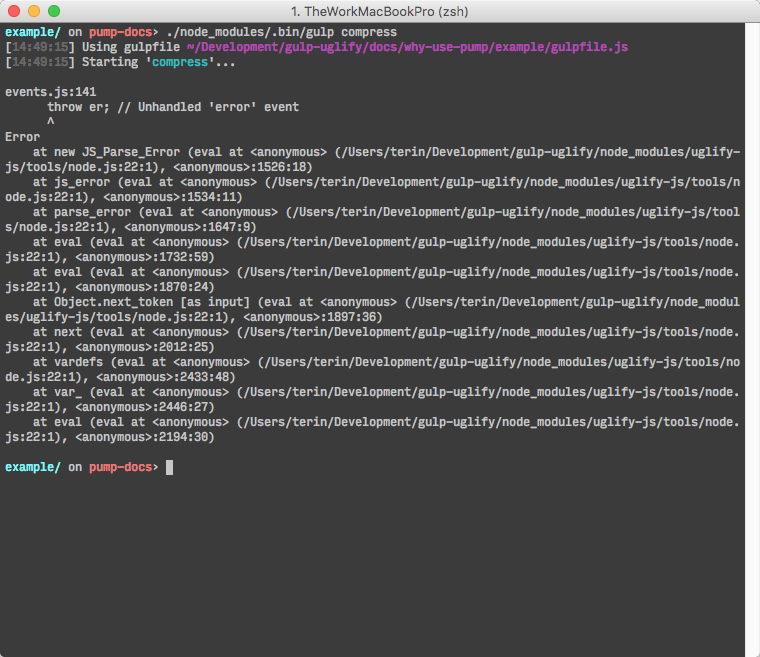

# Por que usar o Pump?

Quando usamos o método `pipe` das _streams_ Node.js:

* Erros não se propagam adiante nas _piped streams_;
* _source streams_ não fecham se uma _destination stream_ tiver fechado.

O módulo [`pump`][pump] normaliza esses problemas e te passa os erros, em um callback.

## Um exemplo comum de gulpfile

Um padrão comum em arquivos gulp é de, simplesmente, retornar uma _stream_ Node.js e esperar que o gulp lide com os erros.

```javascript
// exemplo comum de gulpfile
var gulp = require('gulp');
var uglify = require('gulp-uglify');

gulp.task('compress', function () {
  // retorna um stream Node.js, mas não lida com mensagens de erro
  return gulp.src('lib/*.js')
    .pipe(uglify())
    .pipe(gulp.dest('dist'));
});
```



A mensagem mostra que tem um erro em um dos arquivos JavaScript, mas ela não é muito convidativa. Você só quer saber qual arquivo e linha contém o erro. Então: pra que essa bagunça toda?

Quando ocorre algum erro em uma _stream_, a _stream_ Node.js dispara o evento de erro. No entanto, se você não tiver algo que lide com esse evento, ele será passado para o [uncaught exception handler][uncaughtException].

O comportamento padrão do _uncaught exception handler_ está documentado assim:

> Por padrão, Node.js lida com determinadas exceções imprimindo o _stack trace_ no
> _stderr_, seguido de _exit_.

## Lidando com Erros

Já que não é legal permitir que erros sejam passados para o _uncaught exception handler_, nós devemos fazer lidar com essas excessões, apropriadamente.

Vamos arriscar:

```javascript
var gulp = require('gulp');
var uglify = require('gulp-uglify');

gulp.task('compress', function () {
  return gulp.src('lib/*.js')
    .pipe(uglify())
    .pipe(gulp.dest('dist'))
    .on('error', function(err) {
      console.error('Error in compress task', err.toString());
    });
});
```

Infelizmente, a função `pipe` da _stream_ Node.js não passa os erros adiante na cadeia, então, esse _error handler_ só lida com os erros passados por `gulp.dest`.

Invés disso, nós precisaríamos lidar com erros, em cada _stream_.

```javascript
var gulp = require('gulp');
var uglify = require('gulp-uglify');

gulp.task('compress', function () {
  function createErrorHandler(name) {
    return function (err) {
      console.error('Error from ' + name + ' in compress task', err.toString());
    };
  }

  return gulp.src('lib/*.js')
    .on('error', createErrorHandler('gulp.src'))
    .pipe(uglify())
    .on('error', createErrorHandler('uglify'))
    .pipe(gulp.dest('dist'))
    .on('error', createErrorHandler('gulp.dest'));
});
```

Isso adiciona muita complexidade em cada um de suas tarefas e é fácil de esquecer de fazer isso.

Além do mais, não é uma solução perfeita porque não sinaliza ao sistema de tarefas gulp que a tarefa falhou.

Nós podemos consertar isso e lidar com os outros _errinhos_ usando propagação de erros com _streams_ (mas dá mais trabalho ainda!).

## Usando pump

O módulo [`pump`][pump] é meio que uma artimanha: um envólucro para a funcionalidade do `pipe`, que lida com esses erros por você.

Com isso, ele te ajuda a parar com gambiarras em seus gulpfiles e se concentrar na implementação de recursos do seu app.

```javascript
var gulp = require('gulp');
var uglify = require('gulp-uglify');
var pump = require('pump');

gulp.task('compress', function (cb) {
  pump([
      gulp.src('lib/*.js'),
      uglify(),
      gulp.dest('dist')
    ],
    cb
  );
});
```

O sistema de tarefas gulp disponibiliza uma tarefa em forma de _callback_, o qual pode sinalizar que sua tarefa finalizou bem-sucedida ou não.

* Para sinalizar que uma tarefa foi bem-sucedida: deve-se invocar o _callback_ sem argumentos;
* Para sinalizar que a tarefa foi mal-sucedida: deve-se invocar o _callback_ passando um argumento do tipo _Error_.

Felizmente, esse é o mesmo método que o `pump` usa!


Agora, fica bem claro de saber: qual plugin, arquivo, linha e oquê era o erro.

[pump]: https://github.com/mafintosh/pump
[uncaughtException]: https://nodejs.org/api/process.html#process_event_uncaughtexception
