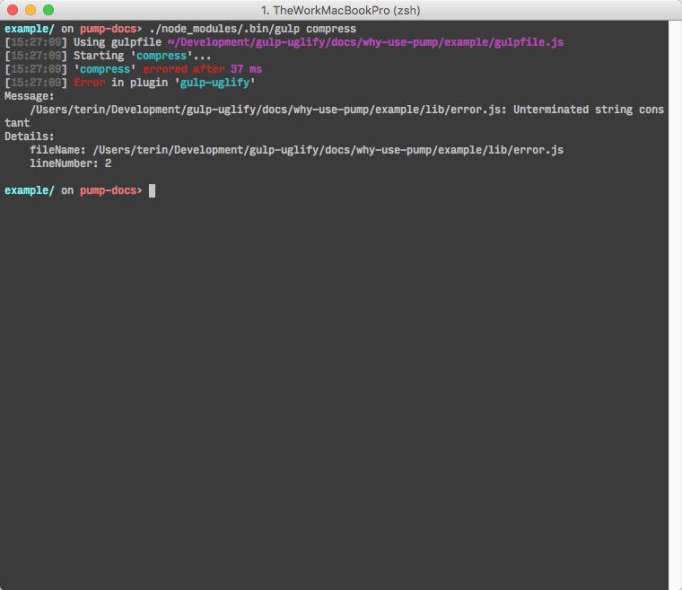

# Why Use Pump?

When using `pipe` from the Node.js streams, errors are not propagated forward
through the piped streams, and source streams aren’t closed if a destination
stream closed. The [`pump`][pump] module normalizes these problems and passes
you the errors in a callback.

## A common gulpfile example

A common pattern in gulp files is to simply return a Node.js stream, and expect
the gulp tool to handle errors.

```javascript
// example of a common gulpfile
var gulp = require('gulp');
var uglify = require('gulp-uglify');

gulp.task('compress', function () {
  // returns a Node.js stream, but no handling of error messages
  return gulp.src('lib/*.js')
    .pipe(uglify())
    .pipe(gulp.dest('dist'));
});
```


There’s an error in one of the JavaScript files, but that error message is the
opposite of helpful. You want to know what file and line contains the error. So
what is this mess?

When there’s an error in a stream, the Node.js stream fire the 'error' event,
but if there’s no handler for this event, it instead goes to the defined
[uncaught exception][uncaughtException] handler. The default behavior of the
uncaught exception handler is documented:

> By default, Node.js handles such exceptions by printing the stack trace to
> stderr and exiting.

## Handling the Errors

Since allowing the errors to make it to the uncaught exception handler isn’t
useful, we should handle the exceptions properly. Let’s give that a quick shot.

```javascript
var gulp = require('gulp');
var uglify = require('gulp-uglify');

gulp.task('compress', function () {
  return gulp.src('lib/*.js')
    .pipe(uglify())
    .pipe(gulp.dest('dist'))
    .on('error', function(err) {
      console.error('Error in compress task', err.toString());
    });
});
```

Unfortunately, Node.js stream’s `pipe` function doesn’t forward errors through
the chain, so this error handler only handles the errors given by
`gulp.dest`. Instead we need to handle errors for each stream.

```javascript
var gulp = require('gulp');
var uglify = require('gulp-uglify');

gulp.task('compress', function () {
  function createErrorHandler(name) {
    return function (err) {
      console.error('Error from ' + name + ' in compress task', err.toString());
    };
  }

  return gulp.src('lib/*.js')
    .on('error', createErrorHandler('gulp.src'))
    .pipe(uglify())
    .on('error', createErrorHandler('uglify'))
    .pipe(gulp.dest('dist'))
    .on('error', createErrorHandler('gulp.dest'));
});
```

This is a lot of complexity to add in each of your gulp tasks, and it’s easy to
forget to do it. In addition, it’s still not perfect, as it doesn’t properly
signal to gulp’s task system that the task has failed. We can fix this, and we
can handle the other pesky issues with error propogations with streams, but it’s
even more work!

## Using pump

The [`pump`][pump] module is a cheat code of sorts. It’s a wrapper around the
`pipe` functionality that handles these cases for you, so you can stop hacking
on your gulpfiles, and get back to hacking new features into your app.

```javascript
var gulp = require('gulp');
var uglify = require('gulp-uglify');
var pump = require('pump');

gulp.task('compress', function (cb) {
  pump([
      gulp.src('lib/*.js'),
      uglify(),
      gulp.dest('dist')
    ],
    cb
  );
});
```

The gulp task system provides a gulp task with a callback, which can signal
successful task completion (being called with no arguments), or a task failure
(being called with an Error argument). Fortunately, this is the exact same
format `pump` uses!



Now it’s very clear what plugin the error was from, what the error actually was,
and from what file and line number.

[pump]: https://github.com/mafintosh/pump
[uncaughtException]: https://nodejs.org/api/process.html#process_event_uncaughtexception
